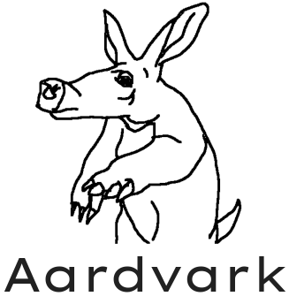
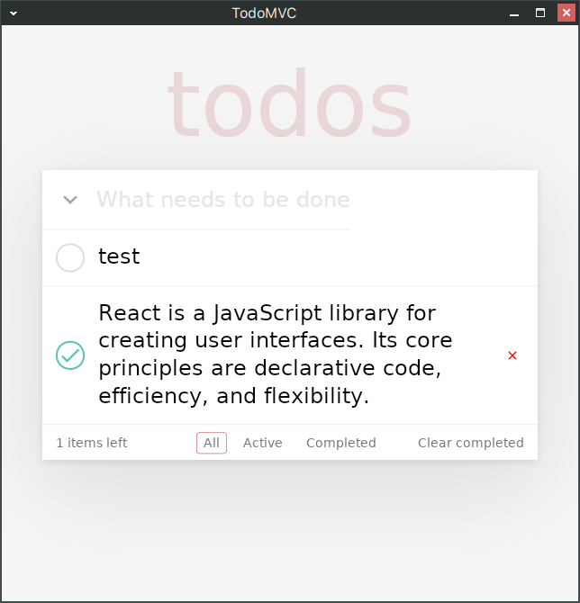

# Aardvark

Currently Aardvark is under development and not ready for use.

  

Aardvark is a library for creating cross platform applications for desktop and
mobile devices using JavaScript and React.

Aardvark includes own GUI rendering engine written in C++ that uses Skia library
for hardware-accelerated rendering of 2D graphics.
It does not use system controls or web view, everything is rendered from scratch.
Such approach makes possible to get exactly expected result on all platforms.

Goal of this project is to allow developers to control by themselves how their
applications should work, and not depend on the features and limitations of
different platforms.

## Goals

### Cross-platform

Reuse same code and get exactly expected result on different desktop and mobile platforms.

### Easy

Building applications using familiar technologies &ndash; Javascript and React, without unnecesary additional steps.

### Small

Small application distributive size (less than 10Mb zip-archive or apk).
 
Low memory consumption (<50Mb RAM).

### Fast

It should have enough performance to render UI smoothly on most modern devices.

### Flexible

Aardvark should allow developers to extend and modify the platform to better suit
the needs of their application, and choose different trade-offs between weight, speed
and features.

## Development status

  

### Platforms

- 🔨 Desktop Linux
- 🔨 Android
- ⌛ Windows
- ⌛ Macos
- ⌛ Ios

### Features

- ✅ Basic rendering
  - ✅ Layout elements
  - ✅ Decorations (background, border, radius, shadows)
  - ✅ Png and svg images
  - ✅ Inline rendering
  - ✅ Hit testing and event handling
- ✅ JS bindings
- ✅ React renderer
- 🔨 Inline editing
- ⌛ Native extensions
