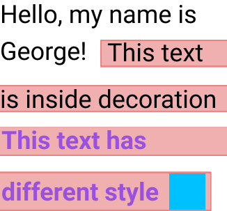
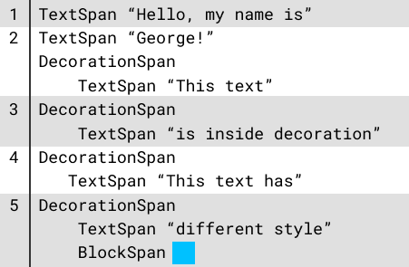
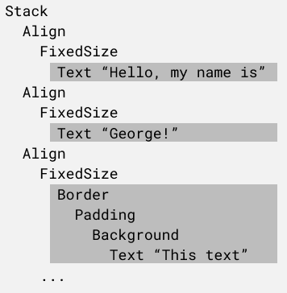

# Inline layout

inline containers like paragraph

Different inline containers can implement 
for example, wrapping text around vector part, layout in columns or pages, 
truncating content with ellipsis

spans
	represents some inline content
	determines how they should layout and paint 

Inline layout is similar to document layout

takes constraints from parents and return size

in document layout there are two possible results
element can fit and not fit
and parent decides what to do with it

in inline layout third result is possible
when part fits on the current line
and remaining part can be wrapped to the next line.

span can split itself into two new spans and inline container
continue layout 
which itself can split again

## Span types 

- **TextSpan**

  Text with different styles.

- **DecorationSpan**

  Span that contains another spans and decorates them with background, border, padding.

- **BlockSpan**

  Span that contains arbitrary element.

- **Spacing**

  Empty space, for example, indent on the first line of a paragraph, 
  or before a list item.

- **ResponderSpan**

  Span that allows to handle events.

## Example



```
<Paragraph>
    <TextSpan>Hello, my name is George!</TextSpan>
    <DecorationSpan {...}>
        <TextSpan>This text is inside decoration</TextSpan>
        <TextSpan style={...}>This text has different style</TextSpan>
        <BlockSpan size={...}>
            <Background color="..." />
        </BlockSpan>
    </DecorationSpan>
<Paragraph>
```

First, paragraph lays out spans into lines.
Spans, which are located on several lines, are divided into several parts.
After performing the layout, content has the following structure:



Then these spans are rendered in the document.
`TextSpan` renders with `Text` element, and `DecorationSpan` renders with
`Border`, `Padding` and `Background` elements.


