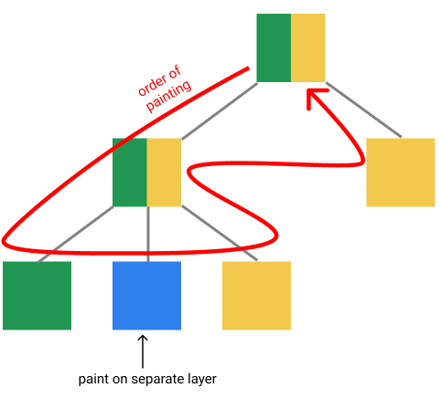
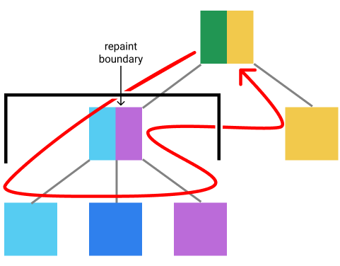
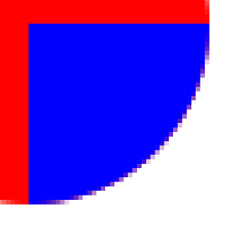
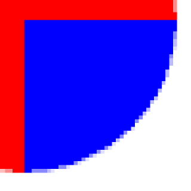

# Rendering

Rendering consists of three phases: layout, painting and compositing.

## Layout
Layout - calculating size and position of each element.
Element takes constraints - minimum and maximum possible size - and decides
what size it wants to be. While doing it, element also calls layout of its
children, and sets their sizes and positions.

Relayout can be performed more effectively than initial layout.
Layout can be performed on closest to changed element relayout boundary.
It is such element, that changes inside of it do not affect layout of its parents,
it isolates all changes inside it.
Here's how to find if an element is a relayout boundary:
- It gets tight constraints, so it can only be one size
- It depends only on the incoming constraints, and not on its own properties.
  For example, when element always expands to all available space.

## Painting
Painting - creating visual representation of elements.
While painting, an element executes own painting commands and calls painting of
its children. Before each set of painting commands, element should request
current surface, because it can be changed, if some children are painted on
separate layers.

Only elements that were changed directly or changed their size or position 
after relayout will update their visual representation.
All other elements will look the same, so they can reuse result of previous
painting. This can be done in two ways:
- Record painting commands into the object, that can be replayed later.
- Painting element onto separate surface and copying it from it. This is called
rasterization. It is fastest, but it requires additional memory.

## Layers system
Support for layers is useful for several reasons:
- It allows to repaint not all layers, but only those on which changed elements
are located.
- Operations with layers, like translating, rotating or changing opacity can be 
performed without repainting, it requires only compositing. Compositing is fast
because it is performed on GPU.
- Some layers come from external sources, for example, camera, video or native
platform view.

It is important to note, that if some element uses a separate layer, then
everything that is painted after it should be placed on another separate layer.
So the element can affect what layers the elements will use in a completely
different part of the document. 
Because of this, it is not clear what needs to be repainted.

To solve this problem, you can use special elements that restrict layers inside.
They are called repaint boundaries. Such elements can be repainted separately.
Using the repaint boundary may require more layers than without it, thats why
you need to specify them manually, not automatically like relayout boundaries.

This is an example how layers change when adding repaint boundary.
Each color shows a separate layer. Element can have two colors, because it
can paint on several layers - before and after painting its children.

Without repaint boundary:



After adding  repaint boundary:



## Clipping

When parent paints its child, it can optionally provide clipping path.
This clip becomes current. If there was clip already, new current clip
is intersection of both paths. Since layers can change transform without
repainting, they must be painted without clipping, and clipping must be applied
when composing this layer.

Clipping is antialiased. This means that pixels near the edge of clip path
can be painted semitransparent to make edge look more smooth.
This may cause artifacts when several colors are painted on top of each other.
Without clip second color fully cover first color, but with clipping
semitransparent pixel of the second color will be painted on top of
semitransparent pixel of the first color and both colors will be mixed.
Artifacts can be avoided by painting clipped elements on separate layer, but
creating additional layers cost performance.

| clipping artifacts | clipping with layer |
|---|---|
|  |  |

```
<FixedSize width={100} height={100}>
  <Clip path={circle}>
    <Background color="red" />
    <Align left={value.abs(50)} top={value.abs(50)}>
      <Background color="blue" />
    </Align>
  </Clip>
</FixedSize>
```

```
<FixedSize width={100} height={100}>
  <Clip path={circle}>
    <Layer>
      <Background color="red" />
      <Align left={value.abs(50)} top={value.abs(50)}>
        <Background color="blue" />
      </Align>
    </Layer>
  </Clip>
</FixedSize>
```

## Hit testing